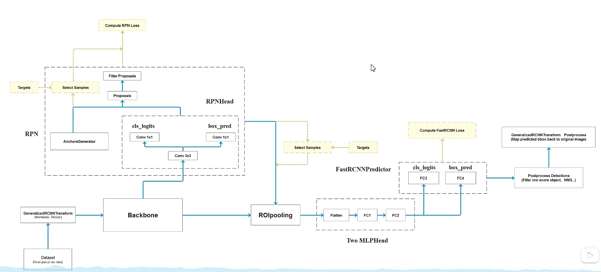

# Faster-RCNN-in-pytorch

## Why this Repo?

This repository is a minimal working code for faster-RCNN. 

Along the way studying how to implement Faster RCNN I have read many blog post and tutorial video. Either 
- the blog posts describe high level detail that do not help implement the model (worse still, most of the blog post share almost the same content), 
or;
- as in the source code from pytorch, the programming structure is deeply nested and difficult to digest for learning.

The video <a href="https://www.youtube.com/watch?v=4yOcsWg-7g8&t=1833s">How FasterRCNN works and step-by-step PyTorch implementation</a> helps me a alot in clarifying all the implementation detail. Unfortunately it still misses a complete training script from which we can reproduce similar results. That results in this repository.

The entry point `main.py` just run the training script defined in `src/train.py`. Because it is for demonstrative purpose, we don't have test set. The model somehow overfits to its training data, but the results are encouraging enough to show that the implementation is ***complete*** and yet ***minimal***.

## Result
Faded white boxes are ROI and blue boxes are the refined ROI predicted from features generated by ROIAlign module:

## Architecture
The architecture of the model is as follows:

